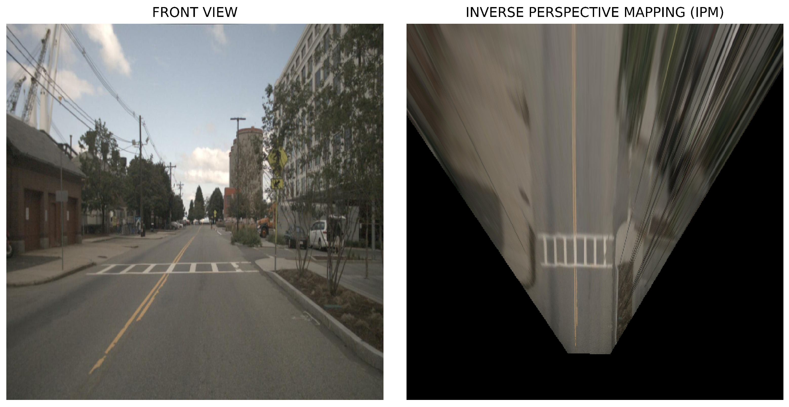

# BEV_Tutorial


## What is BEV (Bird's Eye View)?

**Bird's Eye View (BEV)** is a way of representing the environment **from above**, as if a drone were flying over the robot and looking straight down.

Instead of seeing the world from the robot's front camera, BEV converts sensor data into a **2D top-down map**. This makes it much easier for the robot to understand where obstacles, roads, and free space are located.

The creation of a BEV usually involves processing sensor data, such as LIDAR, camera images or combination of multiple sensors, to generate a top-down representation aligned with the ground plane. By transforming the sensor data into a different coordinate system, BEV enables a comprehensive view that captures a wider field of view and rich geometric information about the scene.


## BEV is widely used in:

- Autonomous Cars.
- UGVs (Unmanned Ground Vehicles)
- Mobile Robots
- Warehouse Robots
- Planetary Rovers

## Perception View (PV) to Bird’s Eye View (BEV):

Perception View (PV) : what the robot's camera sees.

Bird’s Eye View (BEV) : 2D View from above.

## Example to understand the problem : 

Imagine Rover Sees A box using the front camera, it dont know where it is it only knows the pixles, But i need to know where it is to know, distance betweeen me and the obstacle.
so , 

1- Nearby objects look bigger.

2- Distant objects look smaller.

3- You only see what is in front of you.

4- Everything is represented as pixels.

So we use bev to see it from above as we see a map ,

The Rover didn't move.

The Obstacle didn't move.

Only the viewpoint changed.

As We see here the lanes in the road intersect at the end, but when we preform the bev it stays parallel all the Time 


------------------------------------------------------------------------------------------------------------------------------------
# IPM (Inverse Prespective mapping) : 

IPM is used to convert Pixels to Meters to be used by the Rover or the robot, 

**Why** we dont use the pixels only ?

Great question. You have received the lane coordinates in the image space. Pixels tend to get distorted by perceptive and they don’t have any metric meaning. IPM helps us transform those coordinates into a metric ground-plane coordinate system using linear operations.

Imagine that the lane width is 3.5 metres. In the image, at a mid point near the Rover the lanes are 400 pixels apart. A little bit further, it drops down to 300. Further away, 50 pixels. THAT is the problem that we face. As an object is going further and further away in an image, it gets smaller and smaller.

But with our new coordinates, we can establishing a metric scale based on camera calibration and plane geometry such as 1 unit in the image = 1 metre on the ground. Now that you have understood the overall use case for IPM.


---------------------------------------------------------------------------------------------------------------------------------------------------------------------------------------------------------------------
# Two Ways to Perform IPM(Inverse Precpective mapping) : 

There are two common approaches.

## Method 1 — Four-Point Homography

This method is mainly used for:

* Learning homography
* Single images
* Document scanning
* Simple BEV demonstrations

### Step 1

Choose four points in the original image.

```python
src_pts = np.float32([
    [128,252],
    [350,270],
    [311,231],
    [191,222]
])
```

These are pixel coordinates:

```text
[x, y]
```

where

* x = horizontal position
* y = vertical position

---

### Step 2

Choose where those points should appear in the output.

```python
dst_pts = np.float32([
    [70,400],
    [230,400],
    [230,0],
    [70,0]
])
```

This rectangle represents the desired Bird's Eye View.

---

### Step 3

Compute the Homography.

```python
H = cv2.getPerspectiveTransform(src_pts, dst_pts)
```

The result is a 3×3 transformation matrix.

---

### Step 4

Warp the image.

```python
warped = cv2.warpPerspective(
    image,
    H,
    (300,400)
)
```

OpenCV uses the homography matrix to transform every pixel into the new top-down image.

---

here is an Explanation for the Process how it is Done (Mathmatecially):


### Advantages

* Very easy to understand
* No camera calibration required
* Good for experiments

### Disadvantages

* Four points must be selected manually (or detected automatically)
* Camera movement usually requires recalculating the points
* Not ideal for autonomous robots

### Making a Real Project : 

1- Take a lane image 

2- choose four points

3- make Homogrophy

4- see the output

----------------------------------------------------------------------------------------------------------------------------------------------------------------------------------------------------------------------

# Method 2 — Camera Calibration (Intrinsics + Extrinsics)

This is the method used in robotics and autonomous vehicles.

Instead of selecting four points manually, the homography is computed from the camera model.

Required information:

## 1- Camera Intrinsics

Intrinsic parameters describe the camera itself.

```text
K =
[ fx  0  cx ]
[ 0  fy  cy ]
[ 0   0   1 ]
```

Where:

* fx = focal length in x
* fy = focal length in y
* cx = principal point x
* cy = principal point y

These values come from camera calibration or camera specifications.

## 2- Camera Extrinsics

Extrinsic parameters describe where the camera is mounted.

They include:

* Camera height
* Camera position
* Camera rotation
* Camera pitch
* Camera yaw

Example:

```text
Camera Position

Forward = 0.40 m

Height = 0.15 m

Yaw = 0°
```


## 3- Ground Plane Assumption

IPM assumes that everything being projected lies on

```text
Z = 0
```

Due to the premise that the height of all objects is 0— that is, the assumption that all objects are attached to the ground without height—information on the actual ground (roads, lane markings, grass, etc.) Perspective 

Distortionappears normal without being visible, but objects with height, such as cars, appear strange. In other words, they cannot be displayed normally because they violate the premise.

In addition, if the road itself is uphill or downhill, strange shapes occur because it violates the assumption that the height of all objects is 0.


## 4- Homography Computation

The homography is computed mathematically without selecting any image points.

### Advantages

* Fully automatic
* Accurate
* Works on every image
* Suitable for robotics
* Suitable for autonomous vehicles

### Disadvantages

* Requires camera calibration
* Requires camera pose
* More mathematical

--------------------------------------------------------------------------------------------------------------------------------------------------------------------------------------------

# How Are the Four Points Chosen?

When using the four-point method, the selected points should:

* Lie on the ground plane.
* Form a rectangle in the real world.
* Be visible in the camera image.
* Be selected in a consistent order.

--------------------------------------------------------------------------------------------------------------------------------------------------------------------------------------------------------------

# Which Method Should You Use?

Use the **four-point homography method** if you are:

* Learning perspective transforms.
* Working with a single image.
* Building a quick demonstration.
* Scanning documents.

Use the **camera calibration method** if you are:

* Developing autonomous robots.
* Using ROS2.
* Working with mobile robots or autonomous vehicles.
* Building a real-time BEV system.
* Performing lane detection or path planning.

-------------------------------------------------------------------------------------------------------------------------------------------------------------------------------------------------------------------

##  Steps in Implementing Bird's Eye View : 

1- Calibration and Setup :

   - Begin by calibrating the camera to obtain its intrinsic and extrinsic parameters. Typically, this is achieved using a chessboard calibration technique.

   - The known geometry of the chessboard provides a reliable reference, allowing the system to compute the necessary camera parameters accurately.

   - **Intrinsic parameters** : describe the internal characteristics of a camera, defining the relationship between the camera's image plane and pixel coordinates. These parameters include: 
    
     - **Focal Length**: Defines how much the camera zooms in or out, controlling the scale of objects in the image. The focal length is typically represented in terms of the x and y axes: fx and fy.
     
      - **Principal Point**: The pixel coordinates of the optical center of the camera, where the optical axis intersects the image plane. It is represented as (Cx, Cy).
      
      - **Skew Coefficient**: The angle between the x and y axes, usually close to 90°. In most consumer cameras, this value is negligible, but for certain specialized lenses, this could affect the image.

         
      
      - **Distortion Coefficients**: Most camera lenses cause some level of distortion, especially wide-angle lenses. This distortion can be of two types:
      
      - **Radial Distortion**: Causes straight lines to appear curved (barrel or pincushion distortion).
       
          
        
       - **Tangential Distortion**: Occurs when the lens and the image plane are not perfectly aligned.

          
        
      These intrinsic parameters can be represented in a matrix, often referred to as the intrinsic matrix K:

      **Extrinsic parameters** : describe the camera's position and orientation relative to the world. They consist of:
      
        - **Rotation Matrix (R)**: Describes the **camera's orientation** in the world.
        
        - **Translation Vector (T)**: Describes the **camera's position** in the world. The translation vector has three components representing the camera's displacement along the x, y, and z axes.

2- Detecting Key Points for Homography



3- Warping the Image Using Homography

4- Post-Processing and Refinement

------------------------------------------------------------------------------------------------------------------------------------------------------------------------------------------------------------

# Project 1 : 

Using **Rover Nexus** in the simulation **Webots** : 


--------------------------------------------------------------------------------------------------------------------------------------------------------------------------------------------------------------

# Real Hardware Implementation : 

------------------------------------------------------------------------------------------------------------------------------------------------------------------------------------------------------------------

# Bev Fusion : 

In Lidar we convert , In camera , In Radar 


@ Copyrights MindCloud Robotics team,Faculty of Engineering ,Alexandria Universty,Egypt


